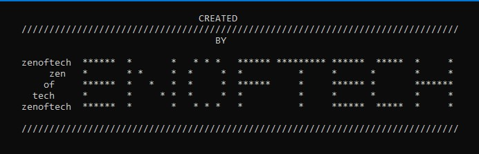

  <h1 align="center"> Zenoftech's logo </h1>

### The python file `zen.py` in this repo is a user built module for my this account logo.

# Output

## OR 

### The python file `loveZen.py` for a love emoji.

# Output

---
### For proper Usage or to make yours, reach out to me.

 

 

  
 
  

